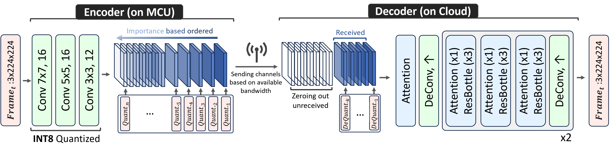

# [MCUCoder: Adaptive Video Compression for IoT Edge Devices (Workshop on Machine Learning and Compression, NeurIPS 2024)](https://openreview.net/forum?id=ESjy0fQJJE)

## Overview

MCUCoder is an open-source adaptive bitrate video compression model designed specifically for resource-constrained Internet of Things (IoT) devices. With a lightweight encoder requiring only 10.5K parameters and a memory footprint of 350KB, MCUCoder provides efficient video compression without exceeding the capabilities of low-power microcontrollers (MCUs) and edge devices.


https://github.com/user-attachments/assets/14ad12c9-9779-4d64-8ee8-f2cffe308006

[Video source](https://github.com/facebookresearch/dinov2) 

## Features

- **Ultra-Lightweight Encoder**: Only 10.5K parameters, enabling efficient processing on MCUs.
- **Low Memory Usage**: 350KB memory footprint, making it ideal for edge devices with limited RAM (1-2MB).
- **High Compression Efficiency**: Reduces bitrate by **55.65% (MCL-JCV dataset)** and **55.59% (UVG dataset)** while maintaining visual quality.
- **Adaptive Bitrate Streaming**: Latent representation sorted by importance allows for dynamic transmission based on available bandwidth.
- **Comparable Energy Consumption to M-JPEG**: Ensures efficient power usage for real-time streaming applications.



## Installation Instructions

Follow these instructions to set up the required Python environment for running MCUCoder.

1. Clone this Git repository to your local machine using the following command:

   ```bash
   git clone https://github.com/ds-kiel/MCUCoder
   cd MCUCoder
   ```
2. Create a virtual Python environment

    ```bash
    virtualenv mcucoder
    source mcucoder/bin/activate
    ``` 
3. Install the necessary Python packages by running:

   ```bash
   pip install -r req.txt
   ```

## Train

To train MCUCoder, use the following command:
```bash
python train.py --batch_size <YOUR_BATCH_SIZE> --imagenet_root <YOUR_IMAGENET_PATH> --wandb_name <YOUR_WANDB_NAME> --wandb_project <YOUR_WANDB_PROJECT> --loss <YOUR_LOSS_FUNCTION> --number_of_iterations <TRAIN_ITER> --number_of_channels <N>
   ```

### Example Command
```bash
python train.py --batch_size 16 --imagenet_root "/path/to/imagenet" --wandb_name "MCUCoder_Training" --wandb_project "MCUCoder" --loss "msssim" --number_of_iterations 1000000 --number_of_channels 196
   ```

## Video Encoding and Decoding with MCUCoder

This script allows you to process videos using MCUCoder for encoding and decoding. It takes an input video, applies the model, and saves the output in the specified directory.

### Usage
To process a video, use the following command:
```bash
python video_enc_dec.py --batch_size <YOUR_BATCH_SIZE> --model_path <YOUR_MODEL_PATH> --video_path <YOUR_VIDEO_PATH> --output_dir <OUTPUT_DIRECTORY>
```


## Pretrained models

## License

This project is licensed under the MIT License. See the `LICENSE` file for details.

## Citation

```
@inproceedings{
hojjat2024mcucoder,
title={{MCUC}oder: Adaptive Bitrate Learned Video Compression for IoT Devices},
author={Ali Hojjat and Janek Haberer and Olaf Landsiedel},
booktitle={Workshop on Machine Learning and Compression, NeurIPS 2024},
year={2024},
url={https://openreview.net/forum?id=ESjy0fQJJE}
}
```


